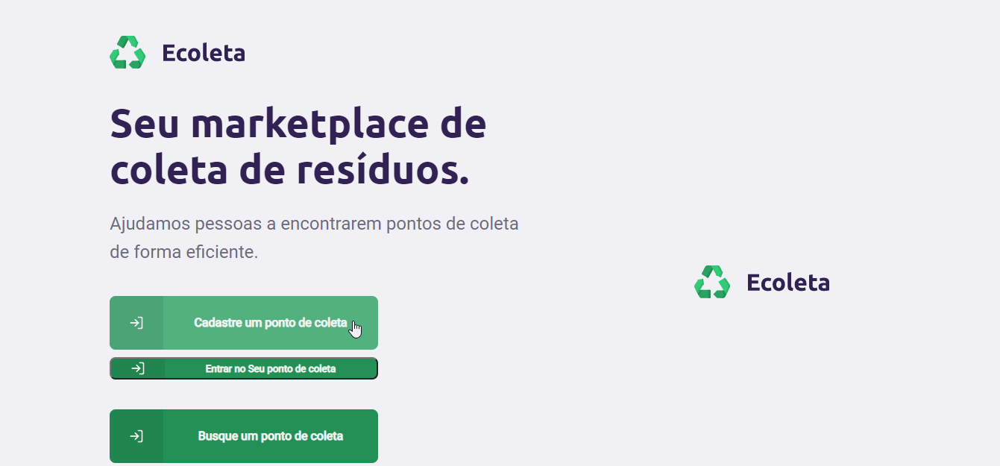

# NLW

  
<h1>
  Ecoleta: Seu marketplace de coleta de resíduos
</h1>

<h1>
  
  
</h1>

## Sobre
Projeto desenvolvido na Next Level Week (NLW) da Rocketseat. O projeto é uma
ação que busca conectar Pontos de Coleta de resíduos a pessoas que desejam descarta-los de forca ecológica.

Além do denvolvimento proposto, aceitei o desafio do professor e CTO da Rocketseat, Diego Schell Fernandes, 
e implementei funcionalidades a mais no projeto: 
  - Login para o ponto de coleta
  - Alterar ou excluir informações do Ponto de coleta
  - Validações extras
  - Busca via web por pontos de coleta com filtro por UF e Cidade

Obrigado Rocketseat!

---
## Tecnologias

 - [REACTJS](https://pt-br.reactjs.org/docs/getting-started.html)
 - [TYPESCRIPT](https://www.typescriptlang.org/docs/home.html)
 - [AXIOS](https://github.com/axios/axios)
 - [SQLite](https://www.sqlite.org/index.html)
 - [Knex](http://knexjs.org/)
 - [API IBGE]
 - [Dropzone](https://www.dropzonejs.com/)
 - [Multer](https://www.npmjs.com/package/multer)
 - [Celebrate](https://github.com/arb/celebrate)
 - [Leaflet](https://leafletjs.com/)

 ---
## Functionalities
  - Login do Ponto de Coleta
  - Adicionar / Remover / Listar / Atualizar: Ponto de Coleta
  - Buscar Pontos de coleta por filtro 

### Conteudo desenvolvido por Guilherme Ferrini 2020 em parceria com Rocketseat na semana NLW.
